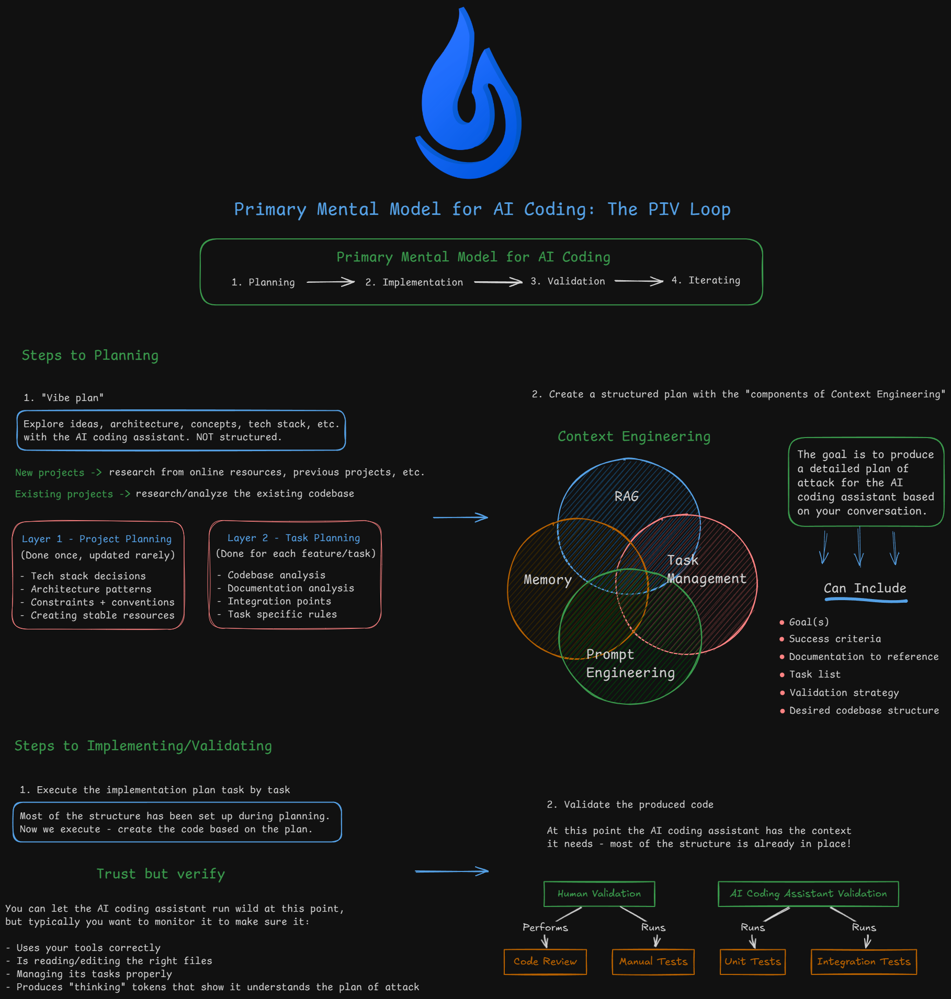

# Bluebeam PDF Map Converter

A web application for converting PDF venue maps from "bid phase" to "deployment phase" by replacing icon annotations. When estimators mark equipment locations on venue maps (sports arenas, concert halls, festivals) with bid icons during the bidding phase, this tool converts those PDF annotations to deployment icons after bid acceptance—eliminating hours of manual re-marking. Built with Python backend (FastAPI, PyMuPDF) and React frontend (planned).

## Prerequisites

- **Python 3.11+** with [uv](https://github.com/astral-sh/uv) package manager
- **Node.js 18+** with npm
- **Git** (optional, for cloning)

## Quick Start

### 1. Clone and Setup Backend

```bash
cd backend
uv sync
uv run uvicorn app.main:app --reload --port 8000
```

Backend runs at http://localhost:8000 (API docs at http://localhost:8000/docs)

### 2. Setup Frontend (new terminal)

```bash
cd frontend
npm install
npm run dev
```

Frontend runs at http://localhost:5173

### 3. Open the App

Navigate to **http://localhost:5173** in your browser. Upload your pdf files and start converting!

## Architecture

```
┌─────────────────┐     HTTP/JSON      ┌─────────────────┐
│ React/Vue.js    │ ◄───────────────► │ Flask/FastAPI   │
│   Port 5173     │                    │   Port 8000     │
└─────────────────┘                    └────────┬────────┘
                                                │
                                       ┌─────────────────┐
                                       │  BTX Processing │
                                       │  XML + zlib     │
                                       └─────────────────┘
```

### Tech Stack

| Layer | Technology |
|-------|------------|
| Backend | Python 3.11, Flask/FastAPI, XML parsing, zlib compression |
| Frontend | React/Vue.js, Drag-drop file upload, Progress indicators |
| Processing | BTX XML parsing, Icon mapping, File reconstruction |

### Project Structure

```
Bluebeam Conversion/
├── backend/
│   ├── app/
│   │   ├── main.py           # Flask/FastAPI entry point
│   │   ├── btx_parser.py     # BTX XML parsing and decompression
│   │   ├── icon_mapper.py    # Bid to deployment icon mapping
│   │   ├── file_processor.py # File upload/download handling
│   │   └── routers/          # API endpoints
│   │       ├── upload.py     # File upload endpoint
│   │       └── convert.py    # Conversion endpoint
│   └── tests/                # pytest tests
├── frontend/
│   ├── src/
│   │   ├── components/
│   │   │   ├── FileUpload/   # Drag-drop upload interface
│   │   │   ├── IconPreview/  # Visual icon mapping preview
│   │   │   └── BatchProcess/ # Batch processing controls
│   │   ├── pages/            # Route pages
│   │   └── lib/              # Utilities
│   └── package.json
├── toolchest/                # BTX files and Gear Icons
├── samples/                  # Sample icons and maps
│   ├── icons/                # bidIcons and deploymentIcons
│   └── maps/                 # BidMap.pdf and DeploymentMap.pdf
├── bluebeamPlan.md          # Project plan document
└── README.md
```

## Features

- **PDF Map Conversion** — Convert bid icon annotations to deployment icons automatically
- **Rich Icon Rendering** — Deployment icons include gear images, brand text, and model labels
- **Device ID Assignment** — Sequential IDs assigned per device type (j100, k101, aa100, etc.)
- **Legend Cleanup** — Automatically removes legend and gear list annotations during conversion
- **High Conversion Rate** — 93.5% annotation conversion (376/402 on sample BidMap.pdf)
- **Fast Processing** — Full conversion in ~1 second
- **Coordinate Preservation** — Icons remain at exact same positions after conversion
- **Download Ready** — Download converted PDF immediately after processing

## API Endpoints

| Method | Endpoint | Description |
|--------|----------|-------------|
| GET | `/health` | Health check with mapping/toolchest status |
| GET | `/` | Root endpoint with API info |
| POST | `/api/upload` | Upload PDF venue map for conversion |
| POST | `/api/convert/{upload_id}` | Convert bid annotations to deployment icons |
| GET | `/api/download/{file_id}` | Download converted PDF file |

Full API documentation available at http://localhost:8000/docs when backend is running.

## Claude Commands

Slash commands for Claude Code to assist with development workflows. The AI coding workflow used to build this application follows the PIV (Prime, Implement, Validate) loop shown below:



### Planning & Execution
| Command | Description |
|---------|-------------|
| `/core_piv_loop:prime` | Load project context and codebase understanding |
| `/core_piv_loop:plan-feature` | Create comprehensive implementation plan with codebase analysis |
| `/core_piv_loop:execute` | Execute an implementation plan step-by-step |

### Validation
| Command | Description |
|---------|-------------|
| `/validation:validate` | Run full validation: tests, linting, coverage, frontend build |
| `/validation:code-review` | Technical code review on changed files |
| `/validation:code-review-fix` | Fix issues found in code review |
| `/validation:execution-report` | Generate report after implementing a feature |
| `/validation:system-review` | Analyze implementation vs plan for process improvements |

### Bug Fixing
| Command | Description |
|---------|-------------|
| `/github_bug_fix:rca` | Create root cause analysis document for a GitHub issue |
| `/github_bug_fix:implement-fix` | Implement fix based on RCA document |

### Documentation
| Command | Description |
|---------|-------------|
| `/update` | Sync project docs (PRD.md, CLAUDE.md, README.md, memories.md) based on recent changes |
| `/create-prd` | Generate Product Requirements Document from conversation |
| `/create-claude` | Generate CLAUDE.md project documentation |
| `/create-readme` | Generate README.md based on project details |

### Git
| Command | Description |
|---------|-------------|
| `/git:commit` | Stage files and commit with conventional commit message |
| `/git:push` | Push commits to remote |

### Misc
| Command | Description |
|---------|-------------|
| `/init-project` | Install dependencies, start backend and frontend servers |
